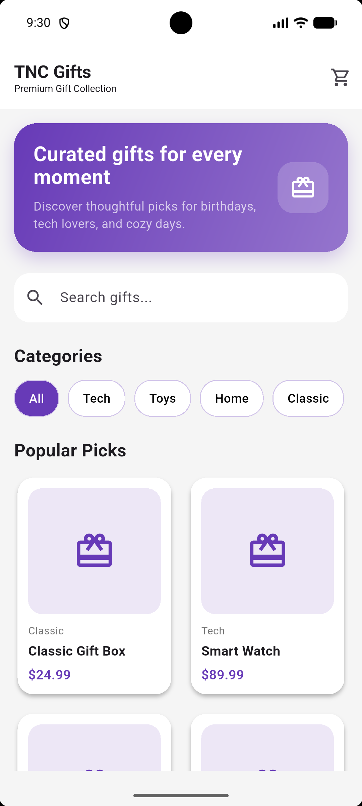
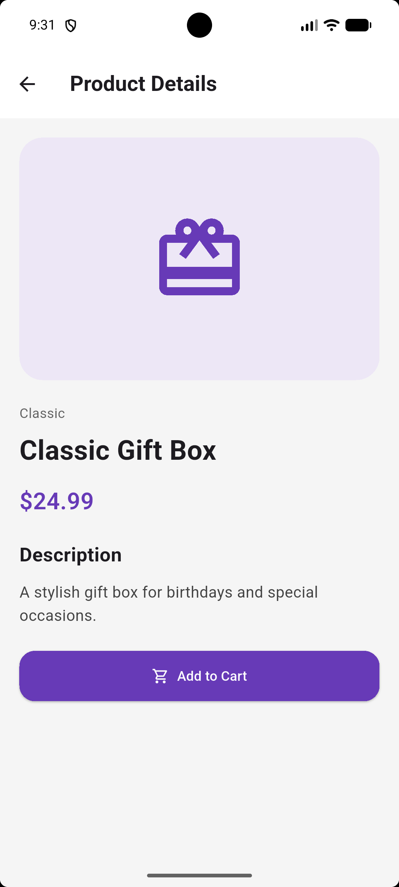
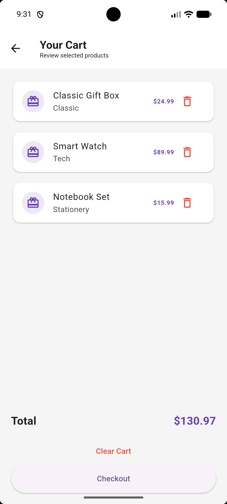

# TNC Gifts – Flutter Gift Store App

A modern Flutter gift store application with clean UI design, category filtering, search functionality, cart management, and responsive layouts.

---

## Features

- 🛍 Product listing screen
- 🔍 Search functionality
- 🏷 Category filtering
- 🛒 Shopping cart system
- ➕ Add to cart
- ➖ Remove from cart
- 🧹 Clear cart
- 🔢 Cart badge counter
- 📱 Responsive UI
- 🎨 Modern Material 3 design
- 📦 JSON serialization support

---

## Technologies Used

- Flutter
- Dart
- Material 3
- Stateful Widgets
- GridView
- Navigation & Routes
- JSON Serialization
- Local Asset Management

---

## Project Structure

```text
lib/
├── data/
├── models/
├── screens/
├── widgets/
└── main.dart
```

---

## Screenshots

### Home Screen



### Product Detail Screen



### Cart Screen




---

## Getting Started

### 1. Clone the repository

```bash
git clone https://github.com/LilLannister/GiftStoreApp-Flutter.git
```

### 2. Navigate to project folder

```bash
cd GiftStoreApp-Flutter
```

### 3. Install dependencies

```bash
flutter pub get
```

### 4. Run the application

```bash
flutter run
```

---

## Developer

Developed by Uğur Ege Çelik
